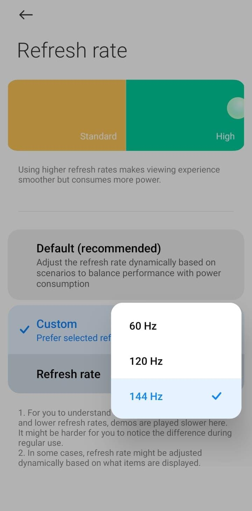
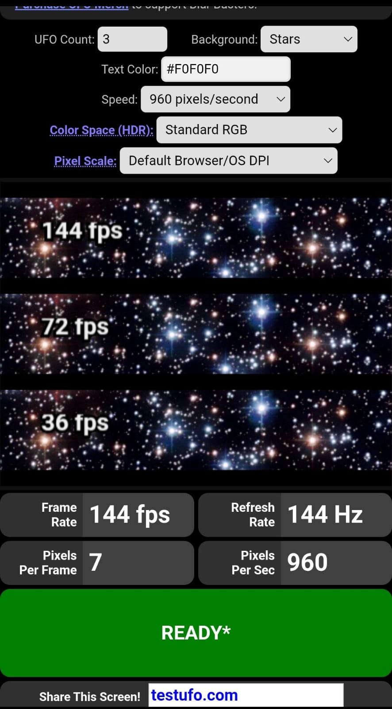
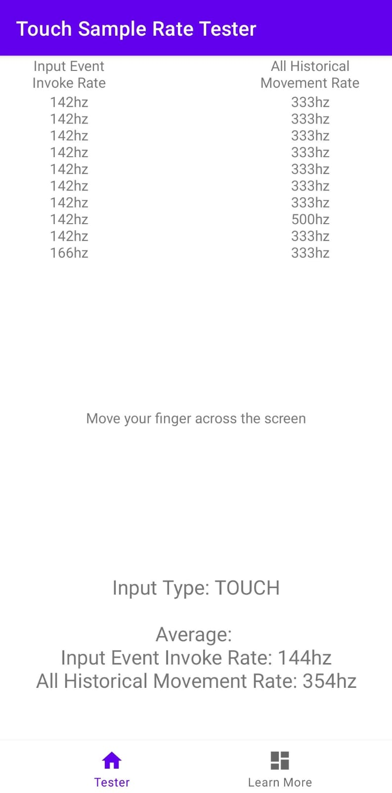

# POCO F4 (munch) 144Hz Display Mod

A clean display mod to enable 144Hz on the POCO F4 / Redmi K40S (`munch`).

The POCO F4 uses a Samsung E4 AMOLED panel that can run at 144Hz. However, older 144Hz mods often had issues with pale/washed-out colors, grey blacks, scanlines, or refresh rate dropping to 60Hz when idle. This project fixes those issues and adds a 144Hz option directly into your phone's Display Settings.

---

## Screenshots

<p align="center">
  
  &nbsp;
  
  &nbsp;
  
</p>

---

## Features

* **144Hz in Settings**: Adds a 144Hz option directly in your official Display Settings (no third-party apps needed).
* **Natural Colors & Black**: Fixes the pale/washed-out colors and glowing grey blacks from older mods.
* **No Scanlines**: Eliminates horizontal lines/flicker on grey backgrounds.
* **No Idle Drop**: Stays at your chosen refresh rate without dropping to 60Hz when idle.
* **Capped at 144Hz**: Disables the unstable 164Hz overclock mode to keep the panel safe.

---

## Downloads

Download the latest files from GitHub Releases or the [`out/`](out/) folder:

1. **All-in-One Module (Recommended)** (`ksu_munch_144hz_display_unlock.zip`):
   * Universal installer for **KernelSU**, **Magisk**, **APatch**, or **TWRP**.
   * Flashes the 144Hz DTBO and automatically backs up your current one.
   * Enables the 144Hz option in Settings (MIUI/HyperOS) or configures AOSP natively.
2. **Standalone DTBO Flashable ZIP** (`twrp_munch_144hz_display_unlock.zip`):
   * Simple TWRP recovery installer that only flashes the DTBO partition.
3. **Raw DTBO Image** (`dtbo.img`):
   * For flashing via Fastboot: `fastboot flash dtbo dtbo.img`.

---

## How to Install

### Option A: Via KernelSU / Magisk / APatch (Recommended)
1. Open your root manager app (**KernelSU**, **Magisk**, or **APatch**).
2. Go to the **Modules** tab, tap **Install from storage**, and select `ksu_munch_144hz_display_unlock.zip`.
3. Follow the on-screen volume key prompt (or wait 8 seconds for auto-detect).
4. Reboot your phone.
5. In MIUI/HyperOS: Go to **Settings -> Display -> Refresh rate**, and choose **144 Hz**.

### Option B: Via TWRP Recovery
1. Boot into **TWRP Recovery**.
2. Select **Install**, choose `twrp_munch_144hz_display_unlock.zip` (or `ksu_munch_144hz_display_unlock.zip`), and swipe to flash.
3. Reboot to system.

### Option C: Via Fastboot
```bash
fastboot flash dtbo dtbo.img
```

---

## How to Uninstall

* If installed as a module: simply tap **Remove** in KernelSU/Magisk and reboot. The uninstaller will restore your original stock DTBO automatically.
* If flashed via recovery or fastboot: flash your stock DTBO backup back to the DTBO partition.

---

## Compatibility

* **ROMs**: MIUI 13, MIUI 14, HyperOS, and AOSP custom ROMs.
* **Root**: KernelSU, Magisk, APatch, or rootless.

---

## Known Notes

* **Brightness Shift**: At 144Hz, the screen is naturally slightly brighter (~19%) than at 120Hz because the panel fires 20% more refresh pulses per second. If it feels too bright, simply adjust your brightness slider slightly down.

---

## Credits

* **Author**: [fatidaprilian](https://github.com/fatidaprilian)
* **GitHub Repository**: [munch-144hz](https://github.com/fatidaprilian/munch-144hz)
* **Hardware Base**: Xiaomi & Black Shark (original E4 DSI parameters)

---

## Disclaimer

While tested and verified on the POCO F4 hardware, flash at your own risk. Always keep a backup of your stock DTBO before flashing.
